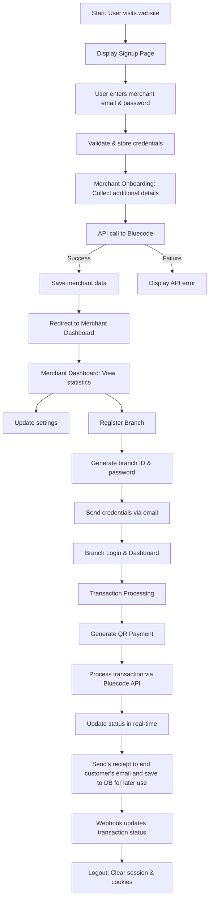

# Blue-Code

## Hackathon Submission

**Team:** SYNTAX_SLAYERS  
**Team Member:** Okonkwo Ifechukwu Michael  

## Project Overview
**Blue-Code Merchant Application** is a robust platform designed using the MVC (Model-View-Controller) architecture. It facilitates user signup, merchant onboarding, branch registration, and transaction processing with real-time updates via webhooks and websockets.

### 🔗 Important URLs
- **Branch Portal (Merchant API):** `localhost:8080/bluecode.ng/public/branch/dashboard`
- **Merchant Portal (Acquibase API):** `localhost:8080/bluecode.ng/public/merchant/dashboard`
- **User/Merchant Signup:** `localhost:8080/bluecode.ng/public/signup`
- **Branch Enrollment:** Available after updating settings in the merchant dashboard.
- **Branch Portal Signup:** `localhost:8080/bluecode.ng/public/branch/login`
- **Merchant Login Credentials:** Use the merchant/contact email and password from the signup page. Successfully registered credentials can be found in the `merchant` and `users` tables.

## 📌 Features
### 1️⃣ User Signup & Merchant Onboarding
- Users register with their merchant email and password.
- Merchant details are collected during onboarding.
- API calls validate and store data in the database.

### 2️⃣ Merchant Dashboard
- Displays statistics: total transactions, total branches, available balance.
- Merchants can update their settings.

### 3️⃣ Branch Registration & Management
- Merchants can register branches.
- Unique branch IDs and passwords are generated and sent via email.
- Branches log in and manage transactions.

### 4️⃣ Transaction Processing
- Branches generate QR code payments.
- Transactions are processed via Bluecode API.
- Real-time status updates via webhooks and websockets.

### 5️⃣ Secure Logout
- Clears sessions and cookies securely.

## 🛠 Flowchart


## 📂 Key Modules
### User Signup & Merchant Onboarding
- **Views:** `views/signup.php`, `views/merchantSignup.php`
- **Controllers:** `AuthController::processSignup()`, `MerchantController::create()`
- **Models:** `User`, `Merchant`
- **Flow:**
  1. Collect signup details
  2. Validate and send to API
  3. Save in the database

### Merchant Dashboard & Settings
- **View:** `views/merchant_dashboard.php`
- **Controller:** `MerchantController::dashboard()`, `MerchantSettingController::updateSettings()`
- **Flow:**
  1. Display merchant statistics
  2. Allow setting updates

### Branch Registration & Management
- **Views:** `views/merchant_branch_dashboard.php`
- **Controller:** `MerchantBranchController::create()`
- **Models:** `Branch`
- **Flow:**
  1. Register branch
  2. Generate ID & password
  3. Save & send credentials via email

### Transaction Processing
- **Controller:** `TransactionController`
- **Models:** `Transaction`
- **Features:**
  - QR Code Payments (via `qr.io` API)
  - Refunds, cancellations, real-time updates
  - Websockets & Webhooks for transaction status

### Logout
- **Flow:** Clears all session data and cookies securely.

## ⚙️ Running the Application
### Environment Setup
1. Install PHP, MySQL, and XAMPP.
2. Set up the database using the provided SQL scripts.
3. Configure `.env` file with Bluecode API credentials.

### Install Dependencies
```bash
composer install
```

### Start the Server
- Use XAMPP’s Apache server.
- Open your browser and navigate to `http://127.0.0.1:8080/bluecode.ng/public/`

## 🔍 Additional Notes
### Error Handling
- Controllers use `try-catch` blocks for API and DB errors.
- User-friendly error messages are displayed via session messages.

### Security Measures
- Passwords are **hashed** before storage.
- API credentials are stored in `.env` for security.

### Real-Time Features
- **Websockets:** Provides live transaction updates.
- **Webhooks:** Updates transaction statuses asynchronously.

---
### 🚀 Built With
- **PHP (MVC Architecture)**
- **MySQL Database**
- **WebSockets (Ratchet/Pusher)**
- **Webhooks for API callbacks**
- **QR Code API for Payments (qr.io)**

👏 Thanks for checking out **Blue-Code**! Feel free to contribute or report issues. 🚀
